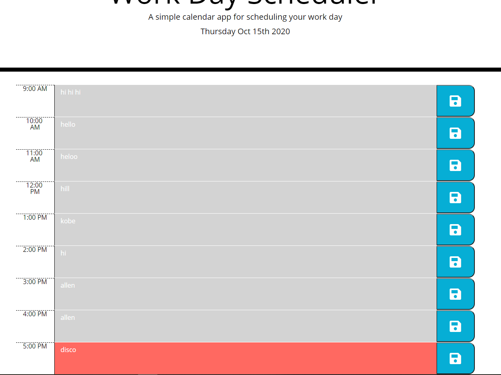

# 05_Work_Day_Scheduler

## User Story

```
AS AN employee with a busy schedule
I WANT to add important events to a daily planner
SO THAT I can manage my time effectively
```

## Acceptance Criteria

```
GIVEN I am using a daily planner to create a schedule
WHEN I open the planner
THEN the current day is displayed at the top of the calendar
WHEN I scroll down
THEN I am presented with time blocks for standard business hours
WHEN I view the time blocks for that day
THEN each time block is color-coded to indicate whether it is in the past, present, or future
WHEN I click into a time block
THEN I can enter an event
WHEN I click the save button for that time block
THEN the text for that event is saved in local storage
WHEN I refresh the page
THEN the saved events persist
```

## Link to the Live Application 
Here is a link that will take you to the live application.

https://kobehill68.github.io/05_WorkDay_Scheduler/

## Project Goal
The goal for thi sproject was to create a day planner which presents the current workday and the hours in that workday.
When you open the page, standard business hours will be presented such as 9-5 and the workday will be broken down in to 
one hour blocks of time. In those one hour time blocks the user wil be adle to enter and schedule events for each hour.

The time blocks are color coded: past, present, future time periods. Past hours will be gray. Present hours will be red. Future hours will be green.
When a time block is selected the user will be able to enter a new event or they can update a current event. When to the user clicks the save icon
it will save the event in local storage, when the application launches it will load the saved schedule.

This application needs to run in the browser and will feature dynamically updated HTML and CSS and is powered by jQuery.

The Moment.js library needs to be utilized to display the corect date and time in the browser.
  
## Solution
The base HTML was modifed to add "id=main-row" to the container. So this serves as the anchor parent for the dynamic elments in my javascript.
All of app devolepment was done in javascript utilizing the jQuery to work with the DOM.

### init function
This sets the correct and current date at the top of the screen. 
And it calls the makeSchedule and renderSchedule functions.

### makeSchedule function
This will loop through my businnessHour array for the predefined workday hours.
It Utilizes jQuery to biuld and define dynamically all the necessary HTML page elments. And it pases the businnessHour array to the 
renderHourShow function.

### renderHourShow
This gets the current businessHour element from the makeSchedule. 
Then it takes the hour and evaluates it against the moment().format("HH") and sets the hourShow equal to
.past, .present, or .future.
Then it Returns hourShow.

### renderSchedule
This will retrive the schedule from the local storage. Then it see if the schedule is empty and it will 
loop through schedule and will load the DOM elements from the stored schedule.


### theSavedSchedule
Thsi will make a new object with the hour and event. Then it will push the new object to the
schedule array. 
And it sets the local storage to the new object.


### .saveBtn
This will get the button-index attr and calls the theSavedSchedule then passing the buttonindex.
And calls the renderSchedule so it can refresh the DOM.


## WorkDay Scheduler
Here is a image of the live application



## Soruces
https://momentjs.com/ & https://www.w3schools.com/ & https://stackoverflow.com/
